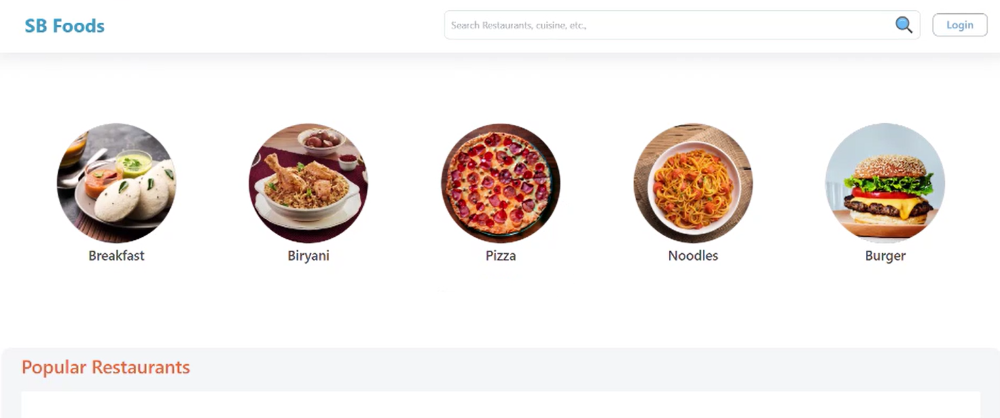
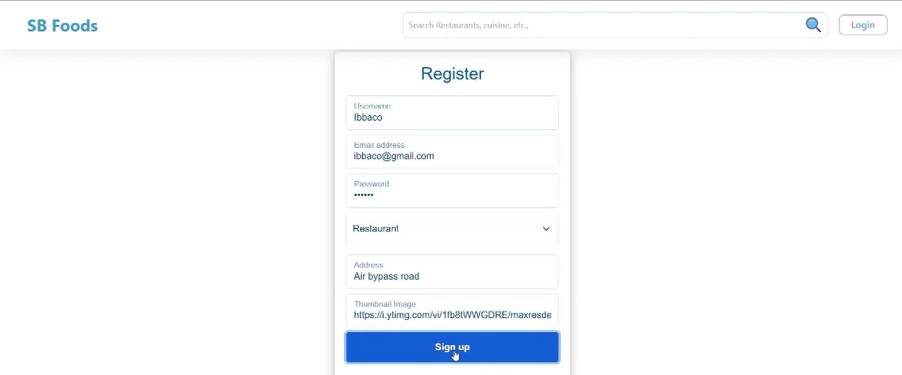
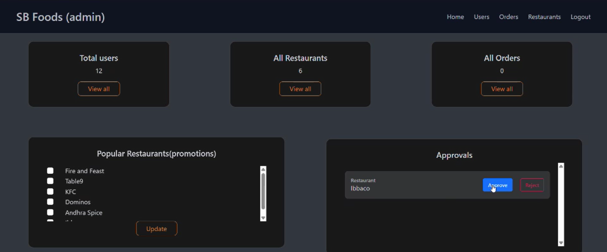
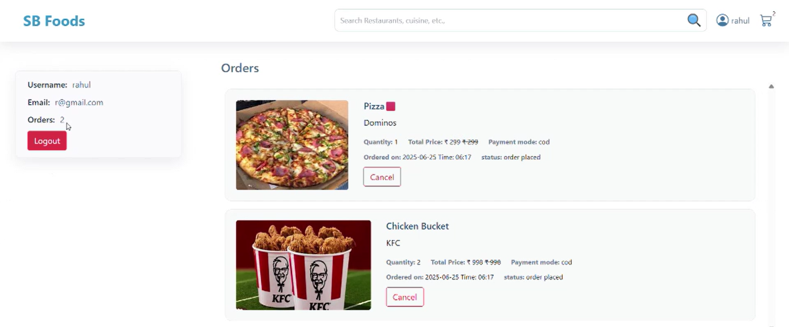

# 🍔 SB Foods – Order on the Go

SB Foods is a full-stack MERN-based food ordering application that allows users to explore restaurants, browse menus, place food orders, and manage them — all in one place. Admins can manage restaurants, approvals, and users with a separate dashboard.

---

## 🚀 Demo Video

🎥 [Click here to watch the demo video](https://drive.google.com/uc?id=1wUCs8f_2uD7Opr5h4FBvdXgEHw80O1um)

---

## 🖼️ Screenshots

### 🔹 Homepage (Categories)


### 🔹 Restaurant Registration Page


### 🔹 Admin Dashboard


### 🔹 User Order Management


---

## 🧰 Tech Stack

- **Frontend**: React.js, CSS / Tailwind CSS
- **Backend**: Node.js, Express.js
- **Database**: MongoDB
- **Authentication**: JWT
- **Tools**: Git, GitHub, Postman

---

## 📦 Features

- 🔍 Search for restaurants and food items  
- 🛒 Add to cart & place orders  
- 📬 Track order status  
- 🔐 User & restaurant authentication  
- 🧑‍💼 Admin dashboard for managing users, restaurants & promotions  
- 📱 Fully responsive design

---

## ⚙️ How to Run Locally

```bash
# 1. Clone the repository
git clone https://github.com/Smohammad121/Order_on_the_go.git
cd Order_on_the_go

# 2. Backend Setup
cd server
npm install
npm start

# 3. Frontend Setup (in a new terminal)
cd ../client
npm install
npm start
